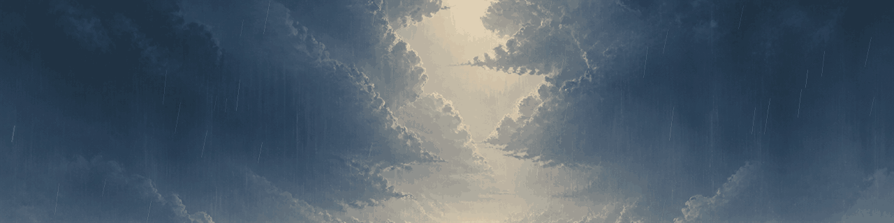
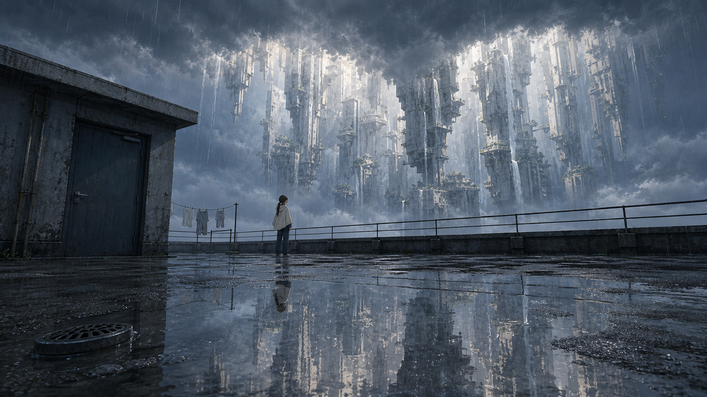
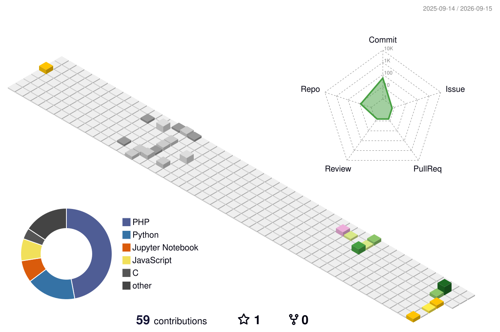
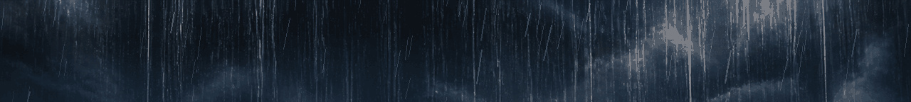

<picture>
  <source media="(prefers-reduced-motion: reduce)" srcset="./assets/banner-static.png">
  
</picture>

<picture>
  
</picture>

  <picture>
    <source media="(prefers-color-scheme: dark)" srcset="https://readme-typing-svg.demolab.com?font=JetBrains+Mono&amp;weight=500&amp;size=22&amp;duration=3200&amp;pause=900&amp;color=79B8D1&amp;center=true&amp;vCenter=true&amp;repeat=true&amp;width=760&amp;height=45&amp;lines=I%27m+Visions%2C+looking+a+little+closer.;I+build+where+vision+meets+curiosity.;After+rain%2C+a+strange+light+remains.">
    <source media="(prefers-color-scheme: light)" srcset="https://readme-typing-svg.demolab.com?font=JetBrains+Mono&amp;weight=500&amp;size=22&amp;duration=3200&amp;pause=900&amp;color=2F789A&amp;center=true&amp;vCenter=true&amp;repeat=true&amp;width=760&amp;height=45&amp;lines=I%27m+Visions%2C+looking+a+little+closer.;I+build+where+vision+meets+curiosity.;After+rain%2C+a+strange+light+remains.">
    
  </picture>

  <picture>
    <source media="(prefers-color-scheme: dark)" srcset="https://skillicons.dev/icons?i=py%2Cpytorch%2Copencv%2Cc%2Cjs%2Chtml%2Ccss%2Cphp&amp;theme=dark&amp;perline=8">
    <source media="(prefers-color-scheme: light)" srcset="https://skillicons.dev/icons?i=py%2Cpytorch%2Copencv%2Cc%2Cjs%2Chtml%2Ccss%2Cphp&amp;theme=light&amp;perline=8">
    
  </picture>

<picture>
  
</picture>

<picture>
  <source media="(prefers-reduced-motion: reduce)" srcset="./assets/footer-static.png">
  
</picture>
